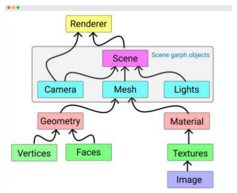
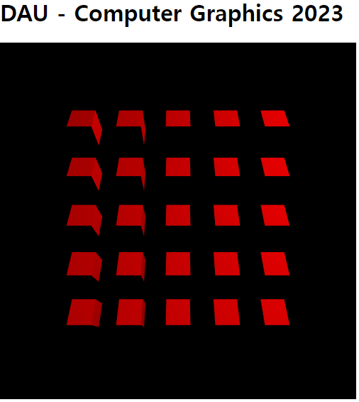

# 3D Primitive Visualization

## 이론
### 3D 데이터의 종류

1. Mesh

* 면들로 데이터를 구성한다. 
* 보통 삼각 메쉬를 많이 사용
* 면들의 집합 == 내부는 비어져있다는 의미

2. Voxel
* Volumetric
* Point Cloud를 임의의 최소 voxel로 설정 -> 큐브를 만들 수 있다. 
* 의료 영상에서 많이 사용된다. 
> pixel의 3차원 개념 ..?

3. Point Cloud
* 점 구름; 점들이 3차원 공간에 떠 다닌다.
* 3d 스캐너로 공간의 정보를 얻는다.(point cloud)
* 레이저를 쐇을 때 튕겨나오는 것을 수집하는 원리를 이용

---

### Mesh

* 많은 양의 삼각형들이 표면을 구성하는 3D 데이터
* 많은 경우 Triangle Mesh를 사용한다. 

> 사각형은 Quads Mesh, 다각형은 Polygon Mesh라고 지칭한다. 

* 3D 모델링/프린팅에서 주로 사용하는 포맷; obj, stl.. 등의 포맷이 존재한다.
* 삼각형을 저장하는 두 가지 방법
  * Separate Triangles(Triangle Soup)
    * 삼각형의 vertex를 모두 따로 각각 저장하는 가장 단순한 방법
    * 메모리 낭비(공통 vertex를 여러 번 저장)
    * 이웃하는 삼각형을 찾는데 추가 시간 소요

  * Indexed Triangle Set
    * Vertex들의 정보 저장, 이후 삼각형 표현은 vertex의 index로 표현
    * 메모리 최적화(공통 vertex는 한 번만 저장)
    * 이웃하는 삼각형 탐색: 공통 vertex 검색
  * Triangle Soup ; 삼각형들이 서로 연결되어 있지 않을 때

### Marching Cube Algorithm

* 3D Volume Data -> Mesh 추출 기법
* 8개의 Voxel를 하나의 set으로 묶어 3D data가 Voxel에 포함되는지 확인
* 2^8 = 256 개 case lookup table 참조
* Linear interpolation 수행 후 mesh 생성  

### Three.js의 Scene 구성

### Three.js의 Mesh
Mesh: 3D object
* Geometry: 형상을 결정하는 요소
    * Three.js에는 미리 정의된 다양한 geometry type이 존재
        (매번 새로 안 만들어도 된다.)
    * Box, Cylinder, Sphere, Torus, Cone, Plane...

* Material: 생상, 재질을 결정하는 요소
    * MeshBasicMeterial: 단색으로 표현
    * MeshLamberMaterial: 빛에 의한 명암만 표현
    * MeshPhongMetreial: 빛에 의한 명암/반짝임 표현(금속 등)

~~~js
const geometry = new THREE.BoxGeometry( 1, 1, 1);
const material = new THREE.MeshBasicMaterial( {color: 0xffff00 });
const mesh = new THREE.Mesh( geometry, material);

Scene.add(mesh);
~~~

---

## 실습

### BoxGeometry로 생성한 mesh
* BoxGeometry(width: Float, height: Float, depth: Float..)

1. Geometry 도형 바꾸고 결과 확인

각각의 주석 풀어서 결과확인

~~~js
function initGeometry() {
    var material0 = new THREE.MeshLambertMaterial({ color: "#ff0000" });
    var Geometry = new THREE.BoxGeometry(1,1,1);
    // var Geometry = new THREE.SphereGeometry(0.5);
    // var Geometry = new THREE.ConeGeometry(1);

    for (var i = 0; i < 5; i++) {
        for (var j = 0; j < 5; j++) {
            var geometry  = new THREE.Mesh(Geometry, material0);
            //Translation
            geometry.translateX(-4.0 + 2.0 * i);
            geometry.translateY(-4.0 + 2.0 * j);
            // Add geometry to Scene
            scene.add(geometry);
        }
    }
}

~~~

2. Mesh 색 변경

* 보라색으로 변경

initGeometry 함수에 material0 객체를 다음과 같이 생성한다.
~~~js
var material0 = new THREE.MeshLambertMaterial({ color: "#FF00FF" });
~~~

* 각기 다른 임의의 색으로 변경 후 결과 확인

생성한 meterial0 객체를 다음과 같이 변경
~~~js
material0.color.setHex(Math.random()*0xffffff)
~~~

3. Mesh 수 증가
* 100개로 개수 늘린 뒤 모두 한 화면에 보이도록 카메라 조정
    * initGeometry의 객체 생성 반복문 부분을 수정한다.
    * 카메라 조정 방법은 두 가지 존재(둘 중 하나만 사용해야한다.)
        * 객체를 그리는 시작 위치를 조정하거나
        * 카메라 자체를 좀 떨어지게 조절한다.

initGeometry 함수 부분
~~~js
function initGeometry() {
    var material0 = new THREE.MeshLambertMaterial({ color: "#ff0000" });
    var Geometry = new THREE.BoxGeometry(1,1,1);

    for (var i = 0; i < 10; i++) {
        for (var j = 0; j < 10; j++) {
            var geometry  = new THREE.Mesh(Geometry, material0);
            // Translation
            // geometry.translateX(-4.0 + 2.0 * i);
            // geometry.translateY(-4.0 + 2.0 * j);
            
            // 객체의 시작 위치를 조정함
            geometry.translateX(-10.0 + 2.0 * i);
            geometry.translateY(-10.0 + 2.0 * j);

            // Add geometry to Scene
            scene.add(geometry);
        }
    }
}
~~~

initRenderer 함수 부분

~~~js
function initRenderer() {
    // 원래는 10인 값을 17로 변경
    camera.position.z = 17;
    renderer.setClearColor("#000000");
    renderer.setSize(500, 500);
    // Append Renderer to DOM
    document.body.appendChild(renderer.domElement);
}
~~~

4. Mesh 중 절반은 wireframe으로 그리기

initGeometry 함수에서 객체를 생성할 때, 각 객체의 material.wireframe 속성에 true를 부여하면 된다.

~~~js
function initGeometry() {
    var material0 = new THREE.MeshLambertMaterial({ color: "#ff0000" });
    var Geometry = new THREE.BoxGeometry(1,1,1);

    for (var i = 0; i < 10; i++) {
        for (var j = 0; j < 10; j++) {
            var geometry  = new THREE.Mesh(Geometry, material0);
            geometry.translateX(-10.0 + 2.0 * i);
            geometry.translateY(-10.0 + 2.0 * j);
            if(j % 2 == 0){
                material0.wireframe = true;
            }
            // Add geometry to Scene
            scene.add(geometry);
        }
    }
}

~~~
